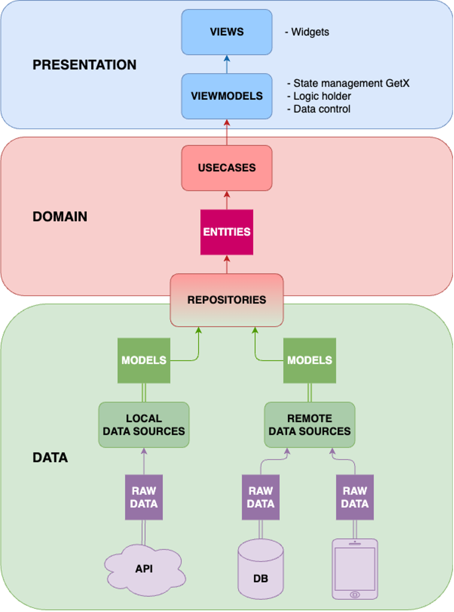

# Clean Architecture

* presentation - Lớp giao diện người dùng, chịu trách nhiệm hiển thị dữ liệu và xử lý sự kiện từ người dùng.

* domain - Lớp chứa logic kinh doanh và quy tắc nghiệp vụ của ứng dụng. Nó định nghĩa các đối tượng, các use case và các interface cho việc giao tiếp với lớp data.

* data - Lớp đảm nhiệm việc truy xuất dữ liệu từ các nguồn khác nhau như cơ sở dữ liệu, API, cache, v.v. Nó cung cấp dữ liệu cho lớp domain.

# Project Structure
lib/

* app - Nơi khai báo các thông tin chung của app như assets, colors, text style, theme, utils...

* presentation - Lớp giao diện người dùng.
    * languages - Ngôn ngữ ứng dụng.
    * modules - Chứa các module theo tính năng của ứng dụng.
        * components - Các thành phần giao diện module
        * cubit - Cubit và State của module
        * widgets - Các widget dùng riêng cho module
        * [module].dart - Giao diện module
    * widgets - Các widget dùng chung cho các module
    * routes.dart - Cấu hình định tuyến các module

* data - Lớp đảm nhiệm việc truy xuất dữ liệu từ các nguồn khác nhau như cơ sở dữ liệu, API, cache... Ứng dụng mobile logic nghiệp vụ không nhiều, lớp domain sẽ được gộp vào lớp data
    * local - Chứa các Data Sources để truy cập dữ liệu từ các nguồn cơ sở dữ liệu local, tệp tin,...
    * repositories - Chứa các Repository để cung cấp data cho lớp presentation.
    * models - Đối tượng dữ liệu.

* config.dart - Config môi trường API...

* di.dart - Khởi tạo Dependency Injection

* main.dart - Main entry.
